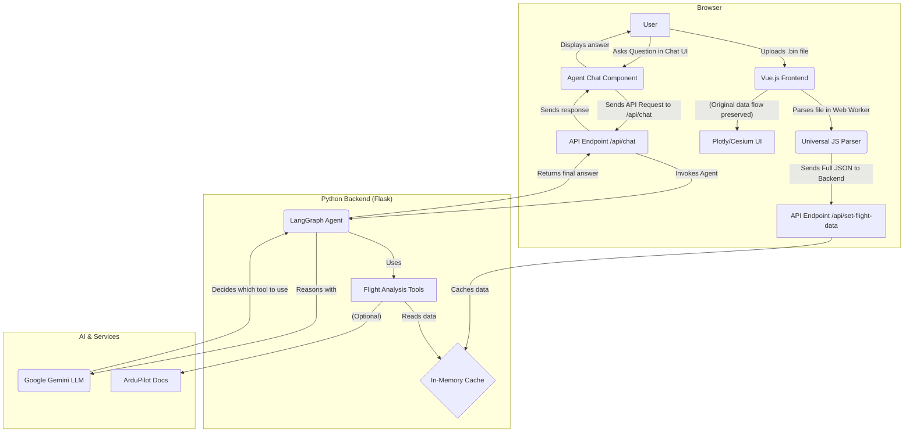

# Agentic UAV Log Viewer

-By Ashutosh Mishra

This project extends the original UAV Log Viewer with a powerful, full-stack agentic chatbot. The chatbot, named "Telemetric Whisperer," allows users to have a natural language conversation about complex flight data from ArduPilot .bin logs.

---

🎥 Live Demo
[Watch on Google Drive](https://drive.google.com/file/d/1EYH6-ZfBR3kCrLGzO8OBJtDHAor9DAxM/view?usp=sharing&authuser=1)

---

✨ Key Features

Agentic Chat Interface: A polished chat UI built in Vue.js allows users to ask questions about their flight logs. The interface supports dark/light modes and chat transcript downloads.
Advanced Tool-Using AI: The backend is powered by a LangGraph agent that uses a suite of 15+ custom tools to analyze flight data. This is not a simple Q&amp;A bot; it's a reasoning engine.
Full-Stack Integration: A new Python Flask backend serves the AI agent and communicates seamlessly with the existing Vue.js frontend.
Deep Log Analysis: The agent can answer specific questions about flight time, max altitude, GPS loss, critical errors, and battery temperature.
Flight Anomaly Detection: Go beyond simple queries. The agent can perform high-level analysis to spot unusual altitude drops, check EKF health, and summarize all detected anomalies across the flight.
Live Documentation Lookup: The agent can scrape the official ArduPilot documentation in real-time to explain error codes and log messages.
Non-Invasive Architecture: The new features are added without breaking any of the original Log Viewer's functionality, using a parallel-parsing strategy in the frontend.

---
🏗️ System Architecture
The application uses a decoupled, full-stack architecture. The frontend handles the user interface and initial client-side parsing, while the Python backend manages the AI agent, tool execution, and communication with the LLM.


🛠️ Tech Stack

Backend: Python 3.10+, Flask, LangChain (LangGraph), Google Gemini
Frontend: Vue.js (2.x), JavaScript
Core Libraries: Pandas (Python), Requests (Python)
Development: Node.js, npm

---
⚙️ Setup and Installation
Follow these steps to set up and run the project locally.

Prerequisites
Python (version 3.10 or newer)
Node.js and npm
Git
1. Clone the Repository
Clone your forked repository to your local machine:

Bash

git clone <your-repository-url>
cd <repository-name>
Note on Git Submodules: This project may use git submodules (e.g., for JSParser). If you find that the src/tools/parsers/JsDataflashParser directory is empty after cloning, you may need to initialize and download it separately by running:

Bash

git submodule update --init --recursive
2. Backend Setup
The backend is a Python Flask server that runs the LangGraph agent.

Bash

# Navigate to the backend directory
cd backend # Assuming you placed the backend code in a 'backend' folder

# Create and activate a virtual environment
python -m venv venv
source venv/bin/activate  # On Windows, use `venv\Scripts\activate`

# Install the required Python packages
pip install -r requirements.txt

# Create a .env file for your API key
touch .env
Open the .env file and add your Google API key:

.env

GOOGLE_API_KEY="YOUR_GOOGLE_API_KEY_HERE"
3. Frontend Setup
The frontend is a Vue.js application. The following commands should be run from the root directory of the project.

``` Bash

# Install Node.js dependencies
npm install
```
### Troubleshooting `npm install`

If you encounter errors during `npm install`, you can run the following `bash` script from the project's root directory to perform a clean reinstallation of all dependencies.

```bash
#!/bin/bash
# This script performs a clean reinstall of npm dependencies.

echo "Removing existing node_modules directory..."
rm -rf node_modules

echo "Clearing npm cache..."
npm cache clean --force

echo "Reinstalling dependencies..."
npm install

echo "Clean installation complete."
```

NOTE: To ensure the project runs correctly, please verify that you have implemented the client-side changes as reviewed:

SideBarFileManager.vue: The call to this.sendDataToBackend(this.state.messages) inside the messagesDoneLoading event should be uncommented.
parser.worker.js: The new parallel parsing logic should be in place to call the UniversalDataflashParser and send data to the backend.

---
Of course. Here is the completed "Running the Application" section for your README.md with the correct commands filled in.

🚀 Running the Application
You will need to run the backend and frontend servers in two separate terminal windows.

1. Start the Python Backend Server:
In your first terminal (from the backend directory, with the virtual environment activated):

``` Bash

# On Windows (CMD/PowerShell):
venv\Scripts\activate

# On macOS/Linux:
source venv/bin/activate

# Now run the Flask application
python app.py
```
You should see output indicating the Flask server is running on http://127.0.0.1:5000.

2. Start the Vue.js Frontend Server:
In your second terminal (from the project's root directory):

``` Bash

# This command starts the frontend development server
npm run serve
```
The application will be available at http://localhost:8080.

---
📋 How to Use

Open your web browser and navigate to http://localhost:8080.
Drag and drop a .bin flight log file onto the drop zone, or click to browse.
Wait for the progress bars to complete. You will see a status message "Agent is ready!" in the sidebar. The developer console will show logs confirming the data has been sent to the backend.
Navigate to the Agent view by clicking the FLight Agent button on the blue bar on top.
The "Telemetric Whisperer" chat interface will appear. You can now ask questions about the flight log.

---
💬 Example Questions
You can ask a wide range of questions, from simple data retrieval to high-level anomaly detection.

Specific Queries:

"What was the highest altitude reached during the flight?" 
"How long was the total flight time?" 
"When did the GPS signal first get lost?" 
"What was the maximum battery temperature?" 
"List all critical errors that happened mid-flight." 
"Was there any RC signal loss?" 

High-Level & Anomaly Detection Queries:

"Are there any anomalies in this flight?" 
"Can you spot any issues in the GPS data?" 
"Summarize all anomalies in this flight."
"Were there any unusual altitude drops?"
"Analyze the EKF health status."

---

💬 Example Conversation
Here is a sample interaction with the Telemetric Whisperer to demonstrate its ability to answer a wide range of questions, from simple data retrieval to complex anomaly analysis and even general knowledge questions related to the domain.

---
🧑 User:
What was the highest altitude reached?

🤖 Agent:
The highest altitude reached during the flight was 1.19 meters. This was recorded at 1 minute and 33 seconds (93.04 seconds raw) into the flight, according to the barometer data.
---
🧑 User:
How long was the total flight time?

🤖 Agent:
The total flight time was 2 minutes and 37 seconds. The flight started at 01:13 (73.82 seconds) and ended at 03:50 (230.96 seconds), based on the GPS timestamp.
---
🧑 User:
Are there any anomalies in this flight?

🤖 Agent:
This flight shows several anomalies:

Critical Errors: The flight log recorded multiple critical errors, including compass errors, and multiple radio and GCS failsafes. There were also some errors from unknown subsystems (IDs 63 and 0), which require further investigation. The timestamps of these errors are provided in the detailed output above.
GPS Issues: A significant GPS signal degradation occurred at 01:13, with zero satellites detected for a prolonged period. The total degraded time was approximately 2 minutes and 37 seconds. The raw telemetry data is available for a more in-depth analysis.
Suspected RC Failsafe: While no explicit RC failsafe event was logged, a mode change suggests a possible RC failsafe around 00:05.
EKF Error: The Extended Kalman Filter (EKF) experienced a recoverable error around 01:14.
The severity and interrelation of these anomalies need further investigation to determine the root cause of the flight issues. The detailed output above contains timestamps and error codes to assist with further analysis.
---
🧑 User:
Hmm. just wondering, can I leverage something like you in vehicle crash analysis?

🤖 Agent:
Yes, a large language model (LLM) like me can be a valuable tool in vehicle crash analysis, although I cannot directly analyze raw crash data files. My capabilities are best utilized in assisting with various aspects of the analysis process. Here's how:

Data Summarization and Organization: I can process and summarize large volumes of data from various sources (police reports, witness statements, sensor data, etc.) to identify key information and patterns. This can significantly reduce the time spent manually reviewing documents.
Report Generation: I can help create well-structured and comprehensive reports, incorporating the findings from the analysis. This includes generating sections on the sequence of events, contributing factors, and conclusions.
Hypothesis Generation: Based on the available data, I can assist in formulating hypotheses about the cause of the crash. I can also help explore different scenarios and their likelihood.
However, it's crucial to remember my limitations:

I cannot replace human expertise: A thorough crash analysis requires the knowledge and judgment of experienced professionals. My role is to assist, not replace, human investigators.
Data Interpretation Requires Context: I need properly formatted and labeled data to interpret it accurately. Raw sensor data requires preprocessing and interpretation by specialists.
In summary, I can be a powerful tool to support vehicle crash analysis, but not conduct it independently. The human element remains essential for accurate and reliable conclusions.
---
🧑 User:
Ok. I am a kid of < 10 years. Explain me how does the BARO factor work

🤖 Agent:
Imagine you're climbing a mountain. The higher you go, the thinner the air becomes, right? A barometer, or BARO, is like a super-sensitive air pressure measuring device.

It measures how much air is pressing down on it. Since there's less air the higher you go, the less pressure the BARO senses. So, by measuring this air pressure, the BARO can figure out approximately how high you are above sea level.

Think of it like this:

Sea level: Lots of air pressing down, high pressure.
Mountain top: Less air pressing down, low pressure.
The BARO measures the difference in pressure to tell you the altitude (height). It's like a clever height-guessing game based on how much air is above! It's not perfectly accurate, but it's a pretty good way to estimate how high something is.
