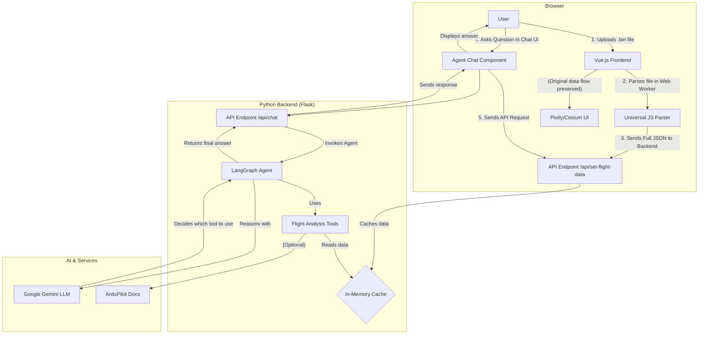

# Agentic UAV Log Viewer

-By Ashutosh Mishra

This project extends the original UAV Log Viewer with a powerful, full-stack agentic chatbot. The chatbot, named "Telemetric Whisperer," allows users to have a natural language conversation about complex flight data from ArduPilot .bin logs.

---

🎥 Live Demo

[Link to your screen-recorded video demonstrating the full functionality. You can upload the video to a service like Google Drive or Dropbox and share the link here, as requested in the challenge instructions.]

---

✨ Key Features

Agentic Chat Interface: A polished chat UI built in Vue.js allows users to ask questions about their flight logs. The interface supports dark/light modes and chat transcript downloads.
Advanced Tool-Using AI: The backend is powered by a LangGraph agent that uses a suite of 15+ custom tools to analyze flight data. This is not a simple Q&amp;A bot; it's a reasoning engine.
Full-Stack Integration: A new Python Flask backend serves the AI agent and communicates seamlessly with the existing Vue.js frontend.
Deep Log Analysis: The agent can answer specific questions about flight time, max altitude, GPS loss, critical errors, and battery temperature.
Flight Anomaly Detection: Go beyond simple queries. The agent can perform high-level analysis to spot unusual altitude drops, check EKF health, and summarize all detected anomalies across the flight.
Live Documentation Lookup: The agent can scrape the official ArduPilot documentation in real-time to explain error codes and log messages.
Non-Invasive Architecture: The new features are added without breaking any of the original Log Viewer's functionality, using a parallel-parsing strategy in the frontend.

---
🏗️ System Architecture
The application uses a decoupled, full-stack architecture. The frontend handles the user interface and initial client-side parsing, while the Python backend manages the AI agent, tool execution, and communication with the LLM.



---

## 🐳 Docker

Run the prebuilt Docker image:

```bash
docker run -p 8080:8080 -d ghcr.io/ardupilot/uavlogviewer:latest
```

Or build it locally:

```bash
# Build Docker image
docker build -t <your-username>/uavlogviewer .

# Run Docker image
docker run -e VUE_APP_CESIUM_TOKEN=<your-cesium-ion-token> -it -p 8080:8080 -v ${PWD}:/usr/src/app <your-username>/uavlogviewer

# Visit http://localhost:8080
```

---

## 💬 New Backend Module: `Chatbotbackend/`

This fork introduces a powerful backend module that enables **LLM-driven UAV log analysis**.

### 📁 Directory Structure

```
Chatbotbackend/
├── app/
│   ├── __init__.py                 # Initializes FastAPI app
│   ├── main.py                     # Routing entry point
│   ├── models.py                   # Pydantic data models
│   └── Services/
│       ├── __init__.py
│       ├── mavlink_parser.py       # Parses MAVLink .bin logs to structured JSON
│       └── llm_service.py          # LangChain tools + agent logic
├── uploads/                        # Temporary store for logs
├── .env                            # Contains API keys and config
└── requirements.txt                # Python backend dependencies
```

---

### 🧠 Capabilities

- 📦 Parses `.bin` files (from frontend) into structured telemetry JSON
- 🧠 LLM-powered Q&A with LangChain tools
- 🧰 Built-in tools: GPS loss, RC signal drop, EKF errors, anomaly detection
- 🔌 Gemini/OpenAI-compatible agent backend

---

### ⚙️ Setup

#### 1. Clone and navigate

```bash
git clone https://github.com/<your-username>/UAVLogViewer.git
cd UAVLogViewer/Chatbotbackend
```

#### 2. Create `.env` file

```ini
GOOGLE_API_KEY=your_gemini_api_key
```

#### 3. Install backend dependencies

```bash
pip install -r requirements.txt
```

#### 4. Run the backend

```bash
uvicorn app.main:app --reload
```

The server runs at `http://localhost:8000`.

---

### 🔍 Example LLM-Powered Tools

- `get_highest_altitude`
- `find_first_gps_loss`
- `list_critical_errors`
- `check_rc_signal_loss`
- `summarize_all_anomalies`
- `analyze_raw_telemetry`
- `lookup_ardupilot_documentation`

These tools allow for professional-grade root-cause analysis of flight anomalies, GPS dropouts, and telemetry corruption.

---

### 📦 Backend Dependencies

```txt
fastapi
uvicorn
pydantic
langchain
google-generativeai
pandas
```

---

This extension makes UAVLogViewer not just a telemetry browser, but a **flight analysis assistant** for robotics engineers, researchers, and QA teams.
